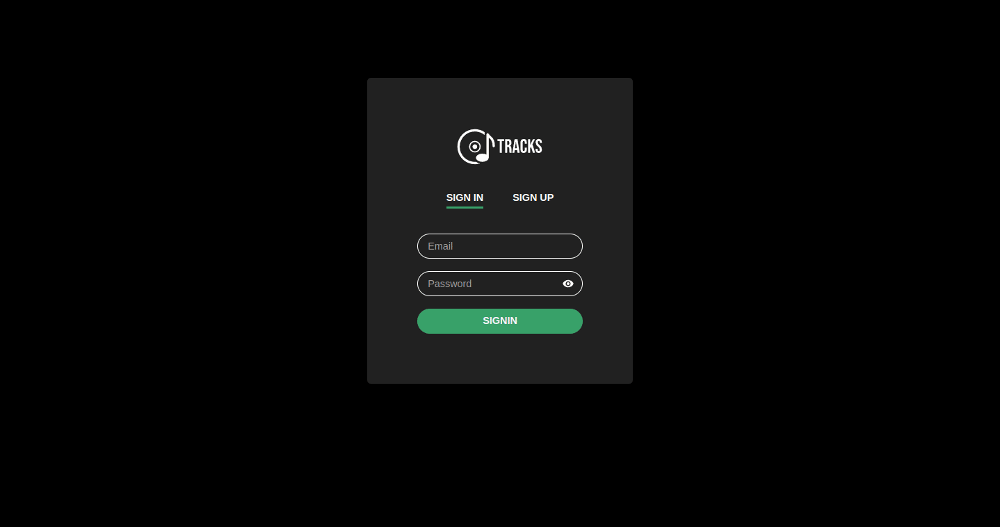
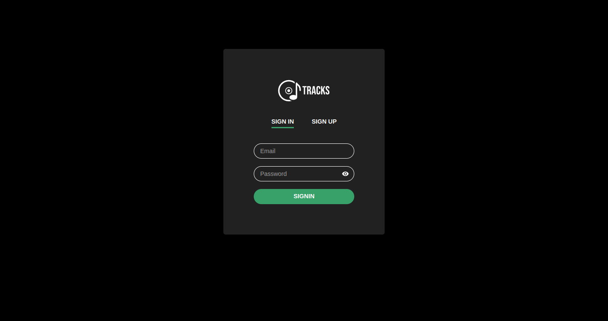
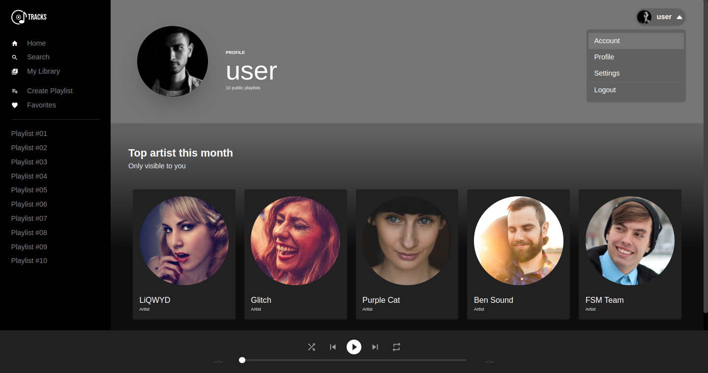
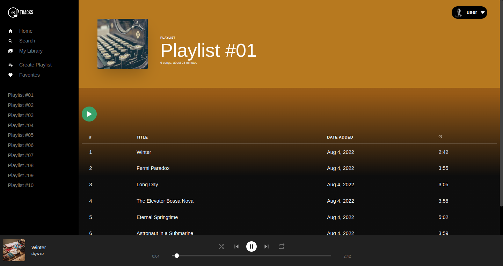

# Tracks

<p align="center">
  
</p>

<h2 align="center">
  A music app heavily inspired by Spotify. Built with ReactJS, 
  Next.js, ChakraUI, Prisma and Typescript.
</h2>

<p align="center">
  

  

  <a href="https://github.com/areasflavio/tracks/commits/master">
    
  </a>
</p>

<p align="center">
  <a href="#star-features">Features</a>&nbsp;&nbsp;|&nbsp;&nbsp;
  <a href="#computer-API-Reference">API Reference</a>&nbsp;&nbsp;|&nbsp;&nbsp;
  <a href="#keyboard-technologies">Technologies</a>&nbsp;&nbsp;|&nbsp;&nbsp;
  <a href="#computer_mouse-installation">Installation</a>
</p>






<br/>

# :star: Features

[(Back to top)](#Tracks)

This is a music app heavily inspired by Spotify. It covers most features with
some of my extra touches.

Some key features are:

- Functional application with Next.JS and Server Side Rendering.
- Front-end state management done with Easy-Peasy.
- Authentication system made with JWT.
- Data fetching with SWR.
- UI built with ChakraUI.
- Serverless backend functions.
- Database built with Prisma ORM and Postgres.

The application is built using ReactJS with Next.JS framework and SSR feature.
Data is provided by Prisma ORM with a serverless API. The user interface is built
with ChakraUI. The entire codebase is written using Typescript.

<!-- <p align="center">
  You also can check the complete <a href="https://tracks.vercel.app">Application Live version</a>
  hosted on:
</p>
<p align="center">
    
</p> -->

<br/>

# :computer: API-Reference

[(Back to top)](#Tracks)

### Sign in with a user

```http
  POST /signin
```

| Body       | Type     | Description                        |
| :--------- | :------- | :--------------------------------- |
| `email`    | `string` | **Required**. Email of the user    |
| `password` | `string` | **Required**. Password of the user |

### Sign up with a user

```http
  POST /signup
```

| Body       | Type     | Description                        |
| :--------- | :------- | :--------------------------------- |
| `name`     | `string` | **Required**. Name of the user     |
| `email`    | `string` | **Required**. Email of the user    |
| `password` | `string` | **Required**. Password of the user |

<br/>

> All next routes need authentication!

<br/>

### Get current user info

```http
  GET /me
```

### Get current user playlists

```http
  GET /playlist
```

### Sign out with a user

```http
  POST /signout
```

# :keyboard: Technologies

[(Back to top)](#Tracks)

This is what I used and learned with this project:

- [x] ReactJS
- [x] Next.JS
- [x] ChakraUI
- [x] Prisma ORM
- [x] Easy Peasy
- [x] JWT
- [x] SWR
- [x] Cookies
- [x] React Howler
- [x] Postgres
- [x] Eslint
- [x] Prettier
- [x] Typescript

<br/>

# :computer_mouse: Installation

[(Back to top)](#Tracks)

To use this project, first you need a Postgres database running, then you can
follow the commands below:

```bash
# Clone this repository
git clone https://github.com/areasflavio/tracks.git

# Go into the repository
cd tracks

# Install dependencies for the application
yarn install

# Copy the .env.example to the .env file and inject your credentials
cp .env.example .env

# Run the database migrations
yarn prisma generate
yarn prisma migrate

# To start the development server, run the following command
yarn dev
```

# :man_technologist: Author

[(Back to top)](#Tracks)

Build by Flávio Arêas 👋 [Get in touch!](https://www.linkedin.com/in/areasflavio/)
